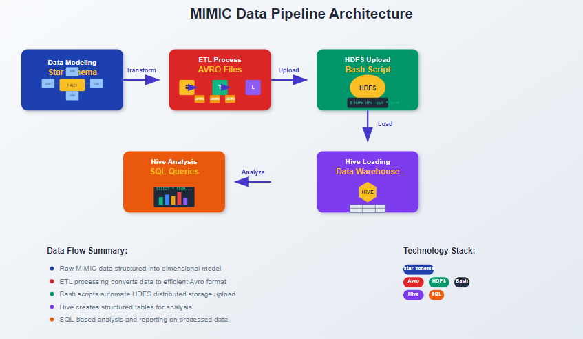

# MIMIC Data Warehouse Star Schema

```mermaid
erDiagram
    FACT_PATIENT_VISITS {
        BIGINT VISIT_SK PK
        BIGINT SUBJECT_ID FK
        BIGINT ICUSTAY_ID
        BIGINT HADM_ID
        BIGINT DIAGNOSIS_SK FK
        BIGINT CG_SK FK
        BIGINT Hosp_LOS
        BIGINT ICU_LOS
        BIGINT Death_date
        boolean DEED_FLAG
        BIGINT ADMIT_DATE_ID FK
        BIGINT DISCHARGE_DATE_ID FK
        BIGINT ICU_ADMIT_DATE_ID FK
    }

    DIM_PATIENT {
        BIGINT SUBJECT_ID PK
        string GENDER
        date DOB
        string MARITAL_STATUS
        string LANGUAGE
        string RELIGION
    }

    DIM_DATE {
        BIGINT DATE_ID PK
        date DATE_VALUE
        number DAY
        number MONTH
        number YEAR
        number QUARTER
        number WEEK
    }

    DIM_DIAGNOSIS {
        BIGINT DIAG_SK PK
        string icd9_code
        string LONG_TITLE
        string SHORT_TITLE
    }

    DIM_ADMISSION {
        BIGINT HADM_SK PK
        BIGINT SUBJECT_ID
        string ADMISSION_TYPE
        string INSURANCE
        boolean HOSPITAL_EXPIRE_FLAG
        string language
        string religion
        string marital_status
    }

    DIM_CAREGIVER {
        BIGINT CG_ID PK
        string label
        string description
    }

    FACT_PATIENT_VISITS ||--o{ DIM_PATIENT : "References"
    FACT_PATIENT_VISITS }|--|| DIM_DATE : "ADMIT_DATE"
    FACT_PATIENT_VISITS }|--|| DIM_DATE : "DISCHARGE_DATE"
    FACT_PATIENT_VISITS }|--|| DIM_DATE : "ICU_ADMIT_DATE"
    FACT_PATIENT_VISITS }|--|| DIM_DIAGNOSIS : "Has"
    FACT_PATIENT_VISITS }|--|| DIM_CAREGIVER : "Assigned"
    FACT_PATIENT_VISITS }|--|| DIM_ADMISSION : "Associated with"


### Key Fixes Applied:
1. **Proper Mermaid diagram closure**: Added blank lines before/after the code block
2. **Corrected image syntax**: Used proper Markdown image formatting
3. **Fixed typos**: 
   - "SUBJECT_ID" (was "SUBJECT_ID")
   - "Assigned" (was "Assigned")
   - Consistent capitalization

### Additional Recommendations:
1. If the image still doesn't appear:
   ```markdown
   

