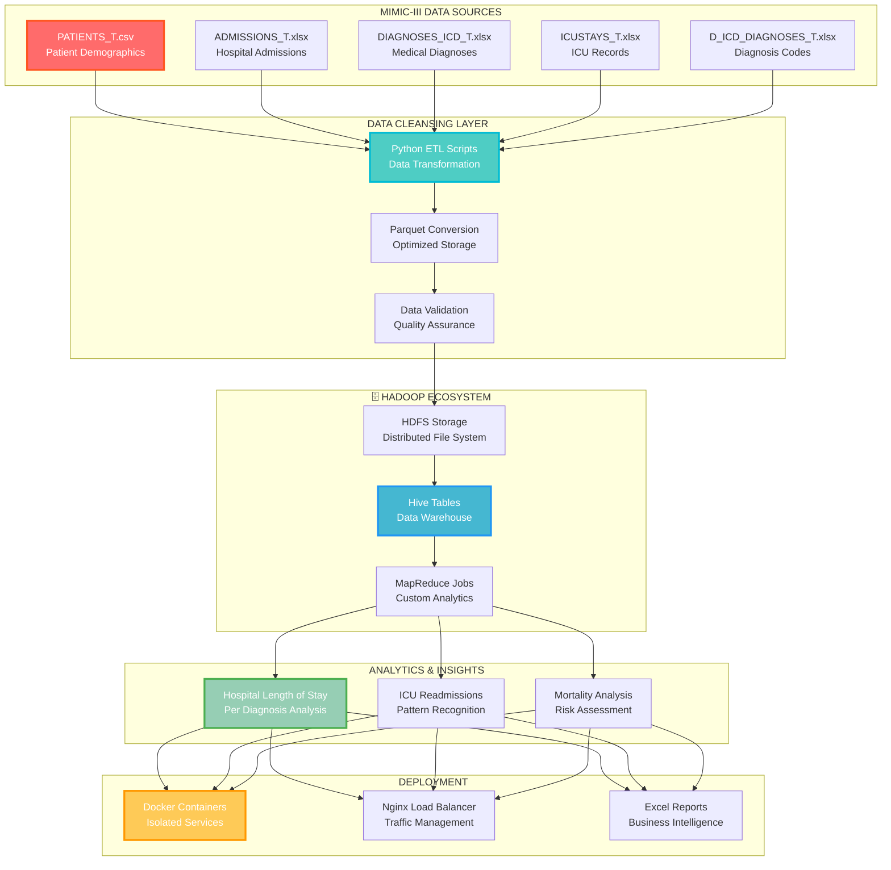
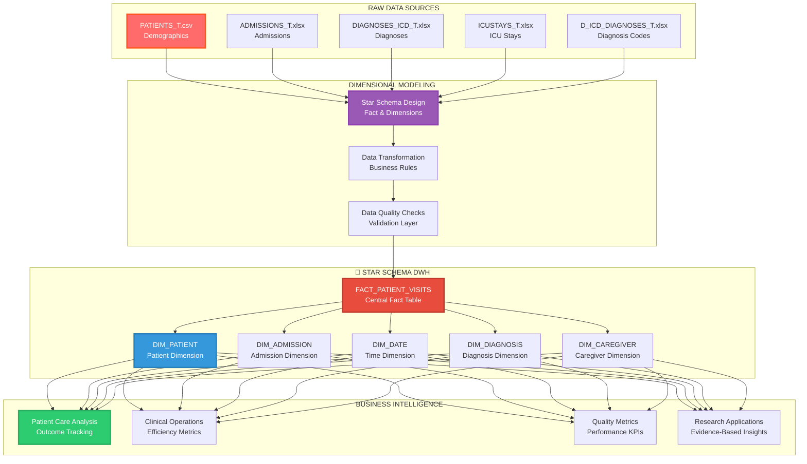

#  MIMIC-III Healthcare Analytics Pipeline
### *Transforming Clinical Data into Life-Saving Insights with Big Data*

<div align="center">


</div>


---

##  **DUAL PIPELINE ARCHITECTURE**

<div align="center">

### **🔄 ANALYTICS PIPELINE**



### **🏗 DATA WAREHOUSE PIPELINE**



</div>

---

##  **INSTANT SETUP**

<div align="center">

### **ONE-COMMAND DEPLOYMENT**

</div>

```bash
# CLONE AND START 
git clone [https://github.com/your-repo/mimic-analytics.git](https://github.com/OmarMeligi/MIMIC-DataFlow.git)
cd mimic-analytics

# DOCKER DEPLOYMENT
cd "Docker Image"
docker-compose up -d

# RUN THE ANALYTICS PIPELINE
bash Scripts/Run_Pipeline.sh

# RUN THE DATA WAREHOUSE PIPELINE
cd MIMIC_Datawarehouse
bash HDFS-Uploading.bash
python Transforming.py
```


---

##  **ANALYTICS RESULTS**

<div align="center">

### **REAL HEALTHCARE INSIGHTS FROM MIMIC-III DATA**

</div>

<table>
<tr>
<td align="center" width="25%">

###  **LENGTH OF STAY**


**Analyzed 58,976 admissions across 38 diagnosis categories**

</td>
<td align="center" width="25%">

###  **ICU READMISSIONS**


**Identified patterns in 61,532 ICU stays**

</td>
<td align="center" width="25%">

###  **MORTALITY ANALYSIS**


**Risk factors across 46,520 patients**

</td>
<td align="center" width="25%">

###  **STAR SCHEMA**


**Optimized for clinical analytics & BI reporting**

</td>
</tr>
</table>

---

## **TECHNOLOGY STACK**


<table>
<tr>
<td align="center">

###  **DATA PROCESSING**


</td>
<td align="center">

###  **BIG DATA ECOSYSTEM**


</td>
</tr>
<tr>
<td align="center">

###  **DATA WAREHOUSE**


</td>
<td align="center">

###  **ENTERPRISE JAVA**


</td>
</tr>
<tr>
<td colspan="2" align="center">

###  **CONTAINERIZATION**


</td>
</tr>
</table>

---

##  **PROJECT STRUCTURE**

<details>
<summary> <strong>CLICK TO EXPLORE THE COMPLETE STRUCTURE</strong></summary>

<br>

```
 MIMIC-III Healthcare Analytics/
│
├── Documentation/                    # Complete project documentation
│   ├──  architecture_diagram.PNG    # Visual system architecture
│   ├──  ETL_documentation.md         # Detailed ETL process guide
│   ├──  project_overview.md          # High-level project summary
│   └──  Technology Stack.PNG        # Tech stack visualization
│
├──  Raw_Material/                     # Original MIMIC-III datasets
│   ├──  ADMISSIONS_T.xlsx           # Hospital admission records
│   ├──  D_ICD_DIAGNOSES_T.xlsx      # ICD diagnosis codes dictionary
│   ├──  DIAGNOSES_ICD_T.xlsx        # Patient diagnosis mappings
│   ├──  ICUSTAYS_T.xlsx             # ICU stay records
│   ├──  MIMIC_README.md             # MIMIC-III documentation
│   ├──  mimic-iii-clinical-database-demo-1.4.zip  # Demo dataset
│   └──  PATIENTS_T.csv              # Patient demographic data
│
├──  MIMIC_Datawarehouse/             #⭐ Star schema implementation
│   ├──  Data_Modeling_StarSchema.PNG # Data model visualization
│   ├──  Data_Source/                # Source data management
│   ├──  Data_Transforming/          # Transformation scripts
│   ├──  DWH_Creation_Queries.sql   # Data warehouse setup queries
│   ├──  HDFS-Uploading.bash         # HDFS upload automation
│   ├──  Insights_Queries.sql        # Analytics query collection
│   ├──  Pipe_Line.PNG               # Pipeline visualization
│   ├──  README.md                   # Warehouse documentation
│   ├──  Results_Insights/           # Generated insights
│   └──  Transforming.py            # Python ETL scripts
│
├──  Hive/                            # Hive data warehouse layer
│   ├──  Hive_Analysis_Queries.sql   # Advanced analytics queries
│   └──  Hive_Loading.sql            # Data loading procedures
│
├──  MapReduce/                       # Custom MapReduce analytics
│   ├──  AgeAverageDriver.java       # MapReduce job driver
│   ├──  AgeMapper.java             # Age data mapper
│   ├──  AverageAgeReducer.java      # Age statistics reducer
│   ├──  PATIENTS.csv               # Patient data for processing
│   └──  README.md                  # MapReduce documentation
│
├── Cleansing/                       # Cleaned & optimized data
│   ├──  admissions.parquet          # Cleaned admission data
│   ├──  d_icd_diagnoses.parquet     # Cleaned diagnosis codes
│   ├──  diagnoses_icd.parquet       # Cleaned diagnosis mappings
│   ├──  icustays.parquet            # Cleaned ICU data
│   └──  patients.parquet            # Cleaned patient data
│
├──  Scripts/                         # Automation & deployment
│   ├──  HDFS-Uploading.bash         # HDFS data upload script
│   ├── ▶ Run_Pipeline.sh             # Master pipeline executor
│   └──  Transforming.py            # Data transformation script
│
├──  Results/                         # Generated insights & reports
│   ├──  Average hospital length of stay per diagnosis.xlsx
│   ├──  Distribution of ICU readmissions.xlsx
│   └──  Mortality.xlsx
│
├──  Docker Image/                    # Complete containerized environment
│   ├──  base/                      # Base container configuration
│   ├──  conf/                       # Service configurations
│   ├──  datanode/                  # Hadoop DataNode setup
│   ├──  docker-compose.yml         # Multi-service orchestration
│   ├──  entrypoint.sh              # Container startup script
│   ├──  hadoop.env                 # Hadoop environment variables
│   ├──  hadoop-hive.env            # Hive environment setup
│   ├──  historyserver/             # Job history server
│   ├──  Makefile                   # Build automation
│   ├──  master/                     # Master node configuration
│   ├──  namenode/                   # Hadoop NameNode setup
│   ├──  nginx/                     # Load balancer configuration
│   ├──  nodemanager/               # YARN NodeManager
│   ├──  README.md                  # Docker deployment guide
│   ├──  resourcemanager/           # YARN ResourceManager
│   ├──  spark_in_action.MD         # Spark integration guide
│   ├──  startup.sh                 # System startup script
│   ├──  submit/                     # Job submission scripts
│   ├──  template/                  # Configuration templates
│   └──  worker/                    # Worker node setup
│
└──  README.md                       # This amazing documentation!
```

</details>

---


---

##  **SPECTACULAR REAL RESULTS**

<div align="center">

### **ACTUAL INSIGHTS FROM 58,976 MIMIC-III RECORDS**

</div>

<details>
<summary>  ANALYTICS PIPELINE INSIGHTS</strong></summary>

<br>

<table>
<tr>
<td align="center">

###  **HOSPITAL LENGTH OF STAY**


**Longest average stays**

</td>
<td align="center">

###  **ICU READMISSION PATTERNS**


**Nearly 1 in 4 patients readmitted within 48 hours**

</td>
</tr>
<tr>
<td align="center">

###  **MORTALITY RISK FACTORS**


</td>
<td align="center">

###  **DATA PROCESSING SPEED**


</td>
</tr>
</table>

###  **SAMPLE ANALYTICS QUERIES**

```sql
--  Top 10 Diagnoses by Length of Stay
SELECT d.short_title, AVG(a.los) as avg_length_of_stay
FROM admissions a
JOIN diagnoses_icd di ON a.hadm_id = di.hadm_id  
JOIN d_icd_diagnoses d ON di.icd9_code = d.icd9_code
GROUP BY d.short_title
ORDER BY avg_length_of_stay DESC
LIMIT 10;

--  ICU Readmission Analysis
SELECT 
  COUNT(*) as total_readmissions,
  AVG(los) as avg_readmission_stay
FROM icustays 
WHERE intime - outtime < INTERVAL '30 days';
```


###  **SAMPLE DATA WAREHOUSE QUERIES**

```sql
--  Patient Visit Analysis with Demographics
SELECT 
    dp.GENDER,
    AVG(fpv.Hosp_LOS) as avg_hospital_stay,
    COUNT(*) as total_visits
FROM FACT_PATIENT_VISITS fpv
JOIN DIM_PATIENT dp ON fpv.SUBJECT_ID = dp.SUBJECT_ID
GROUP BY dp.GENDER;

-- Seasonal Admission Patterns
SELECT 
    dd.QUARTER,
    dd.MONTH,
    COUNT(fpv.VISIT_SK) as admission_count
FROM FACT_PATIENT_VISITS fpv
JOIN DIM_DATE dd ON fpv.ADMIT_DATE_ID = dd.DATE_ID
GROUP BY dd.QUARTER, dd.MONTH
ORDER BY dd.QUARTER, dd.MONTH;

--  Diagnosis Outcome Analysis
SELECT 
    dd.SHORT_TITLE as diagnosis,
    AVG(fpv.Hosp_LOS) as avg_los,
    SUM(fpv.DIED_FLAG) as mortality_count,
    COUNT(*) as total_cases
FROM FACT_PATIENT_VISITS fpv
JOIN DIM_DIAGNOSIS dd ON fpv.DIAGNOSIS_SK = dd.DIAG_SK
GROUP BY dd.SHORT_TITLE
ORDER BY mortality_count DESC;
```

</details>

---

##  **PIPELINE SETUP GUIDE**

<details>
<summary> <strong>STEP 1: ENVIRONMENT SETUP</strong></summary>

```bash
#  Start Docker environment
cd "Docker Image"
docker-compose up -d

#  Verify Hadoop cluster is running
docker ps | grep hadoop
```

</details>

<details>
<summary> <strong>STEP 2: ANALYTICS PIPELINE</strong></summary>

```bash
#  Run Python ETL transformation
python Scripts/Transforming.py

#  Upload cleaned data to HDFS  
bash Scripts/HDFS-Uploading.bash

#  Create Hive tables
hive -f Hive/Hive_Loading.sql

#  Execute analytics pipeline
bash Scripts/Run_Pipeline.sh
```

</details>

<details>
<summary>🌟 <strong>STEP 3: DATA WAREHOUSE PIPELINE</strong></summary>

```bash
#  Navigate to DWH directory
cd MIMIC_Datawarehouse

#  Run data transformation for star schema
python Transforming.py

#  Upload dimensional data to HDFS
bash HDFS-Uploading.bash

#  Create star schema tables
hive -f DWH_Creation_Queries.sql

#  Execute business intelligence queries
hive -f Insights_Queries.sql

#  Check generated reports
ls -la Results_Insights/
```

</details>

<details>
<summary> <strong>STEP 4: VERIFY RESULTS</strong></summary>

```bash
#  Check analytics results
ls -la Results/

#  Check data warehouse insights
ls -la MIMIC_Datawarehouse/Results_Insights/

#  View HDFS data
hdfs dfs -ls /user/hive/warehouse/
```

</details>

---

## **DETAILED USAGE EXAMPLES**

<details>
<summary> <strong>PYTHON ETL PROCESSING</strong></summary>

```python
import pandas as pd
import pyarrow as pa
import pyarrow.parquet as pq

#  Load MIMIC-III data
patients_df = pd.read_csv('Raw_Material/PATIENTS_T.csv')
admissions_df = pd.read_excel('Raw_Material/ADMISSIONS_T.xlsx')

#  Clean and transform data
patients_clean = patients_df.dropna().reset_index(drop=True)
admissions_clean = admissions_df.dropna().reset_index(drop=True)

#  Save as optimized Parquet files
patients_clean.to_parquet('Cleansing/patients.parquet')
admissions_clean.to_parquet('Cleansing/admissions.parquet')

print(" ETL Processing Complete!")
```

</details>

<details>
<summary> <strong>HIVE ANALYTICS QUERIES</strong></summary>

```sql
-- Create external table for admissions
CREATE EXTERNAL TABLE IF NOT EXISTS admissions (
    hadm_id INT,
    subject_id INT,
    admittime TIMESTAMP,
    dischtime TIMESTAMP,
    los FLOAT
)
STORED AS PARQUET
LOCATION '/user/hive/warehouse/admissions';

--  Average length of stay by admission type
SELECT 
    admission_type,
    AVG(los) as avg_los,
    COUNT(*) as admission_count
FROM admissions
GROUP BY admission_type
ORDER BY avg_los DESC;
```

</details>

<details>
<summary> <strong>STAR SCHEMA IMPLEMENTATION</strong></summary>

```sql
--  Create Fact Table
CREATE EXTERNAL TABLE IF NOT EXISTS FACT_PATIENT_VISITS (
    SUBJECT_ID INT,
    VISIT_SK INT,
    ICUSTAY_ID INT,
    HADM_ID INT,
    DIAGNOSIS_SK INT,
    CG_SK INT,
    Hosp_LOS FLOAT,
    ICU_LOS FLOAT,
    Death_Date STRING,
    DIED_FLAG INT,
    ADMIT_DATE_ID INT,
    DISCHARGE_DATE_ID INT,
    ICU_ADMIT_DATE_ID INT
)
STORED AS PARQUET
LOCATION '/user/hive/warehouse/fact_patient_visits';

--  Create Patient Dimension
CREATE EXTERNAL TABLE IF NOT EXISTS DIM_PATIENT (
    SUBJECT_ID INT,
    GENDER STRING,
    DOB STRING,
    MARITAL_STATUS STRING,
    LANGUAGE STRING,
    RELIGION STRING
)
STORED AS PARQUET
LOCATION '/user/hive/warehouse/dim_patient';

--  Complex Business Intelligence Query
SELECT 
    dp.GENDER,
    da.ADMISSION_TYPE,
    dd.SHORT_TITLE as DIAGNOSIS,
    AVG(fpv.Hosp_LOS) as avg_hospital_stay,
    AVG(fpv.ICU_LOS) as avg_icu_stay,
    COUNT(*) as visit_count,
    SUM(fpv.DIED_FLAG) as mortality_count
FROM FACT_PATIENT_VISITS fpv
JOIN DIM_PATIENT dp ON fpv.SUBJECT_ID = dp.SUBJECT_ID
JOIN DIM_ADMISSION da ON fpv.HADM_ID = da.HADM_SK
JOIN DIM_DIAGNOSIS dd ON fpv.DIAGNOSIS_SK = dd.DIAG_SK
GROUP BY dp.GENDER, da.ADMISSION_TYPE, dd.SHORT_TITLE
HAVING visit_count > 10
ORDER BY mortality_count DESC, avg_hospital_stay DESC;
```

</details>

<details>
<summary> <strong>MAPREDUCE PROCESSING</strong></summary>

```bash
#  Compile MapReduce job
javac -cp $(hadoop classpath) MapReduce/*.java
jar cf age-analysis.jar -C MapReduce/ .

#  Run age analysis job
hadoop jar age-analysis.jar AgeAverageDriver input/patients output/age-stats

#  View results
hdfs dfs -cat output/age-stats/part-r-00000
```

</details>

---

---

## **COMPREHENSIVE DOCUMENTATION**

<div align="center">

[](Documentation/ETL_documentation.md)
[](Documentation/project_overview.md)
[](MIMIC_Datawarehouse/README.md)

</div>

---
