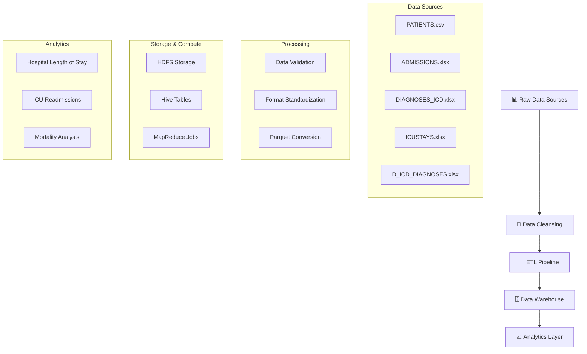

# 🏥 MIMIC-III Healthcare Data Analytics Pipeline

<div align="center">


</div>

## 📋 Project Overview

A comprehensive **big data analytics pipeline** for processing and analyzing the MIMIC-III clinical database. This project implements a complete ETL workflow using modern big data technologies to extract meaningful healthcare insights.

### 🎯 Key Objectives
- **Data Processing**: Clean and transform raw clinical data
- **Data Warehousing**: Implement star schema for optimized analytics
- **Insights Generation**: Extract meaningful healthcare patterns
- **Scalability**: Handle large-scale medical datasets efficiently

---

## 🏗️ Architecture Overview



---

## 🚀 Quick Start

### Prerequisites
- 🐳 **Docker & Docker Compose**
- 🐍 **Python 3.8+**
- ☕ **Java 8+**
- 🗃️ **Apache Hadoop/Hive**

### 🏃‍♂️ One-Click Setup

```bash
# Clone the repository
git clone <repository-url>
cd mimic-healthcare-analytics

# Start the complete pipeline
make start-pipeline

# Or run step by step:
cd "Docker Image"
docker-compose up -d
```

### 📦 Manual Setup

1. **Environment Setup**
   ```bash
   # Start Hadoop ecosystem
   cd "Docker Image"
   docker-compose up -d
   
   # Verify services
   docker ps
   ```

2. **Data Processing**
   ```bash
   # Run data transformation
   python Scripts/Tranforming.py
   
   # Upload to HDFS
   bash Scripts/HDFS-Uploading.bash
   ```

3. **Execute Pipeline**
   ```bash
   bash Scripts/Run_Pipeline.sh
   ```

---

## 📁 Project Structure

<details>
<summary>🔍 Click to expand detailed structure</summary>

```
Project Root/
│
├── 📚 Documentation/           # Project documentation & diagrams
│   ├── architecture_diagram.PNG
│   ├── ETL_documentation.md
│   ├── project_overview.md
│   └── Technology Stack.PNG
│
├── 📦 Raw_Material/           # Original MIMIC-III datasets
│   ├── ADDMISSIONS_T.xlsx
│   ├── D_ICD_DIAGNOSES_T.xlsx
│   ├── DIAGNOSES_ICD_T.xlsx
│   ├── ICUSTAYS_T.xlsx
│   └── PATIENTS_T.csv
│
├── 🏪 MIMIC_Datawarehouse/    # Star schema implementation
│   ├── Data_Modeling_StarSchema.PNG
│   ├── DWH_Creation_Queries.sql
│   ├── Insights_Queries.sql
│   └── Transforming.py
│
├── 🐝 Hive/                   # Hive queries & table creation
│   ├── Hive_Analysis_Queries.sql
│   └── Hive_Loading.sql
│
├── 🗺️ MapReduce/              # Custom MapReduce jobs
│   ├── AgeAverageDriver.java
│   ├── AgeMapper.java
│   └── AverageAgeReducer.java
│
├── 🧹 Cleansing/             # Cleaned data in Parquet format
│   ├── admissions.parquet
│   ├── patients.parquet
│   └── [other cleaned files]
│
├── 🐳 Docker Image/          # Complete containerized environment
│   ├── docker-compose.yml
│   ├── hadoop.env
│   └── [service configurations]
│
└── 📊 Results/               # Generated insights & reports
    ├── Average hospital length of stay per diagnosis.xlsx
    ├── Distribution of ICU readmissions.xlsx
    └── Mortality.xlsx
```

</details>

---

## 🛠️ Technology Stack

<table>
<tr>
<td align="center">

### 🗃️ **Data Storage**


</td>
<td align="center">

### ⚙️ **Processing**


</td>
</tr>
<tr>
<td align="center">

### 🐍 **Languages**


</td>
<td align="center">

### 🐳 **Infrastructure**


</td>
</tr>
</table>

---

## 📊 Key Analytics & Insights

### 🏥 **Hospital Analytics**
- **Average Length of Stay** per diagnosis
- **ICU Readmission Patterns**
- **Mortality Rate Analysis**
- **Patient Demographics**

### 📈 **Generated Reports**

| Report | Description | Format |
|--------|-------------|---------|
| 🏥 **Length of Stay** | Average hospital stay duration by diagnosis | `.xlsx` |
| 🔄 **ICU Readmissions** | Distribution and patterns of ICU readmissions | `.xlsx` |
| 💀 **Mortality Analysis** | Mortality rates across different conditions | `.xlsx` |

---

## 🔧 Pipeline Workflow

### 1. **Data Ingestion** 📥
```bash
# Raw data formats: CSV, XLSX
Raw_Material/ → Data validation & format checks
```

### 2. **Data Cleansing** 🧹
```bash
# Transform to optimized format
python Scripts/Tranforming.py
# Output: Parquet files in Cleansing/
```

### 3. **Data Warehousing** 🏪
```bash
# Create star schema tables
sql DWH_Creation_Queries.sql
# Load data into Hive tables
```

### 4. **Analytics Processing** 📊
```bash
# Run MapReduce jobs
hadoop jar custom-analytics.jar
# Execute Hive analytical queries
```

### 5. **Results Generation** 📈
```bash
# Export insights to Excel reports
Results/ → Business Intelligence reports
```

---

## 🚀 Usage Examples

### Run Complete Pipeline
```bash
# One command to rule them all
bash Scripts/Run_Pipeline.sh
```

### Individual Components
```bash
# Data transformation only
python Scripts/Tranforming.py

# HDFS operations only
bash Scripts/HDFS-Uploading.bash

# Custom MapReduce job
hadoop jar mapreduce/age-analysis.jar input output
```

### Query Examples
```sql
-- Average age by diagnosis
SELECT diagnosis, AVG(age) as avg_age 
FROM patient_diagnoses 
GROUP BY diagnosis;

-- ICU readmission rates
SELECT COUNT(*) as readmissions 
FROM icustays 
WHERE readmission_flag = 1;
```

---

## 📚 Documentation

| Document | Description |
|----------|-------------|
| 📋 **ETL_documentation.md** | Detailed ETL process documentation |
| 🏗️ **project_overview.md** | High-level project architecture |
| 🖼️ **Architecture Diagrams** | Visual system architecture |
| 📊 **Technology Stack** | Complete tech stack overview |

---

## 🤝 Contributing

1. **Fork** the repository
2. **Create** your feature branch (`git checkout -b feature/AmazingFeature`)
3. **Commit** your changes (`git commit -m 'Add some AmazingFeature'`)
4. **Push** to the branch (`git push origin feature/AmazingFeature`)
5. **Open** a Pull Request

---

## 📄 License

This project is licensed under the **MIT License** - see the [LICENSE](LICENSE) file for details.

---

## 🙏 Acknowledgments

- **MIMIC-III Database** - Critical Care Database
- **Apache Hadoop Ecosystem** - Big Data Processing
- **Docker Community** - Containerization Support

---

<div align="center">

### 🌟 **Star this repo if you found it helpful!** 🌟

[](https://github.com/username/repo/stargazers)
[](https://github.com/username/repo/network/members)

**Made with ❤️ for Healthcare Analytics**

</div>